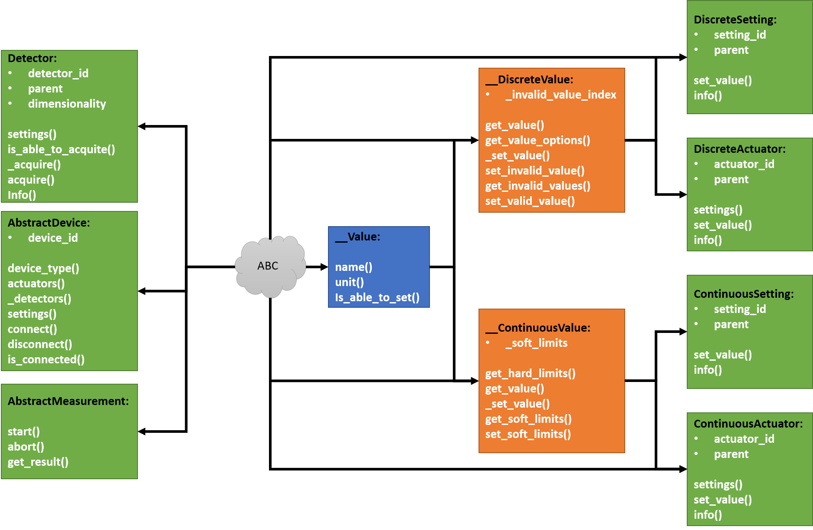

# fastMDA
Generic program for multidimensional acquisition with FastAPI. The program is currently under development and **NOT** 
ready for production. 

## Development
Below are some notes on development.

### Installing `fastmda`
For testing, it is recommended to install the `fastmda` in editable mode:
`pip install -e .` when standing in the project folder. 
For windows there is a convenience script `dev_install.cmd` for doing this.

### Running fastAPI server
To run the fastAPI server with uvicorn in reload mode (where the server reloads everytime you save):
`uvicorn fastmda.main:app --reload`
For windows there is a convenience script `dev_run_server.cmd` for doing this.

### Implementing objects
The object structure is as follows:
